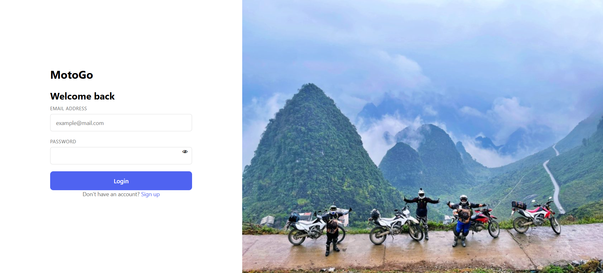
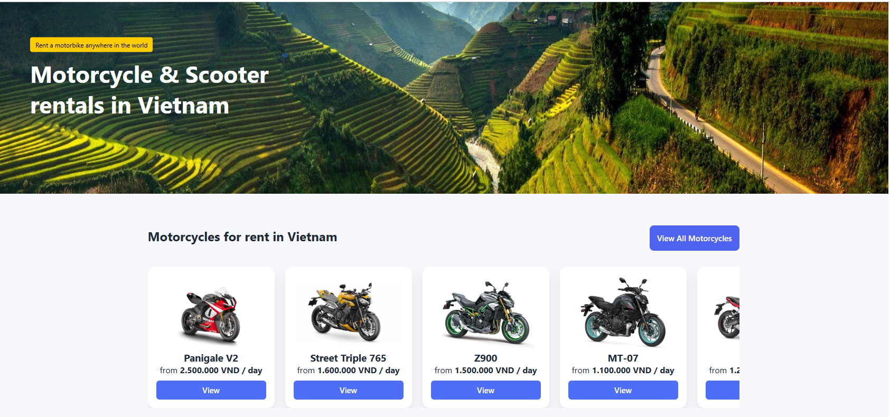
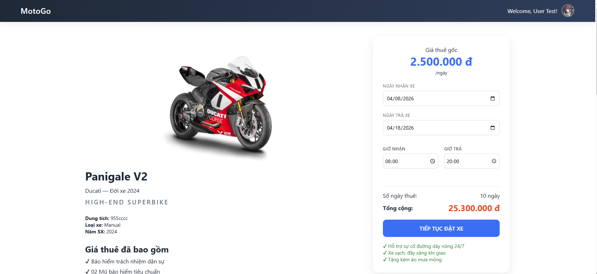
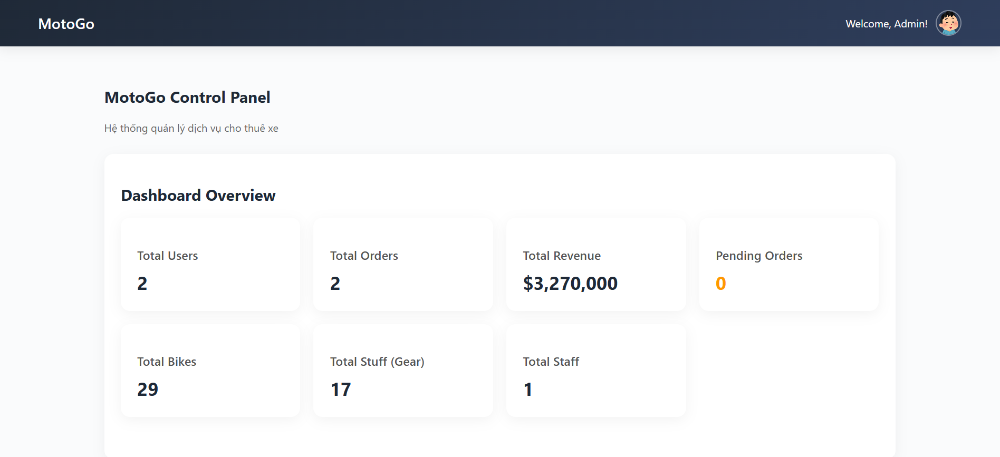

🏍️ Motorbike Rental System
📌 Overview

A Java-based web application for managing motorbike rental operations. The system supports booking workflows, user authentication, and admin management, following the MVC architecture.

This project demonstrates core concepts of Java Web Development, including Servlet, JSP, JDBC, and relational database design.

🚀 Features
👤 User Features
Register / Login / Logout
View available motorbikes
Book motorbikes with availability checking
View booking history
🔐 Admin Features
Manage motorbike inventory (CRUD)
Upload motorbike images
Manage bookings and transactions
Role-based access control (Admin/User)
🏗️ System Architecture

The application follows the MVC (Model - View - Controller) pattern:

Client (Browser)
       ↓
   Controller (Servlet)
       ↓
     Service Logic
       ↓
     DAO Layer
       ↓
   Database (SQL Server)
       ↑
     JSP (View)
📂 Project Structure
src/
 ├── controller/     # Servlet controllers
 ├── dao/            # Data Access Objects (JDBC)
 ├── model/          # Entity classes
 ├── utils/          # Utility classes (DB connection, etc.)
webapp/
 ├── views/          # JSP pages
 ├── css/
 ├── js/
🗄️ Database Design
Main Entities:
Users (user_id, username, password, role)
Motorbikes (bike_id, name, type, price, status, image)
Bookings (booking_id, user_id, bike_id, date, status)
Transactions (transaction_id, booking_id, amount, payment_status)

👉 Database is designed using:

Normalization (3NF)
Foreign key constraints for data integrity
⚙️ Tech Stack
Backend: Java Servlet, JSP
Frontend: HTML, CSS, JavaScript
Database: Microsoft SQL Server
Connectivity: JDBC
Server: Apache Tomcat
Tools: IntelliJ / NetBeans, Git, GitHub
## 📸 Screenshots

### 🔑 Login Page

### 🏍️ Motorbike List

### 📅 Booking Page

### ⚙️ Admin Dashboard

▶️ How to Run
1. Clone repository
git clone https://github.com/hongdz0000/motobikerental.git
2. Setup Database
Create database in SQL Server
Import .sql file (if available)
Update DB connection in code:
String url = "jdbc:sqlserver://localhost:1433;databaseName=YourDB";
String user = "your_username";
String password = "your_password";
3. Run Project
Open project in IntelliJ / NetBeans
Deploy on Apache Tomcat
Access:
http://localhost:8080/motobikerental
🔐 Authentication & Authorization
Session-based authentication
Role-based access control:
Admin
User
📈 Key Learnings
Applied MVC architecture in real project
Built full booking workflow with business logic
Designed relational database with normalization
Implemented authentication & authorization
Worked with Java Servlet, JSP, JDBC
📌 Future Improvements
Use JPA / Hibernate instead of JDBC
Apply Spring MVC / Spring Boot
Add RESTful APIs
Improve UI/UX
Implement payment gateway
👨‍💻 Author

Le Van Hong
📧 hongdz0000@gmail.com

🔗 GitHub: https://github.com/hongdz0000
